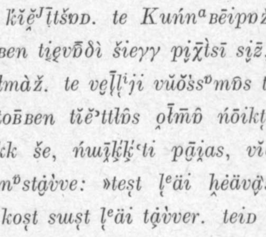

## Langdoc logo

The fish-logo used currently widely on langdoc-website and on affiliated locations (among these this GitHub repository) has to be replaced. Logos are always tricky, but ideally each project would have its own logo and distinct visual style. Unfortunately there tends to be so much work that visual questions such as these can be easy to dismiss and leave to a later date, which again never comes.

One idea could be to use a rotating logos which would be visually similar, but changes every few months or so. On the main langdoc-website there could be a small section called "Current logo", which then explains with few words or a paragraph what is the source of the current logo and what is the work it comes from. This has several benefits:

1. We don't need to stick into one logo
2. We can popularize and bring attention into some lesser known works
3. If each image is around 6-10 lines, it is possible to maintain visually consistent style

## Examples

The page numbers in filenames refer to the actual pages in PDF files stored in Fenno-Ugrica. This is potentially a bad idea, but it was first I came up with.

View to Kildin Saami text published in Koltan- ja kuolanlappalaisia satuja (Itkonen et. al. 1931, p. 15).

View to Komi-Zyrian text published in Syrjänische Volksdichtung (Wichmann 1916, p. 5).

## Image resizing

Please resize the images with this command, or with other command that gives consistent size:

    convert "input.jpg" -resize 450x450 -quality 100 "output.png"

The image doesn't need to be a perfect square, only height will be 450 and the aspect ratio is kept.