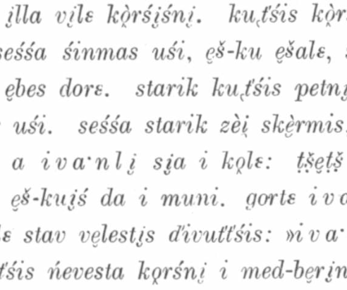
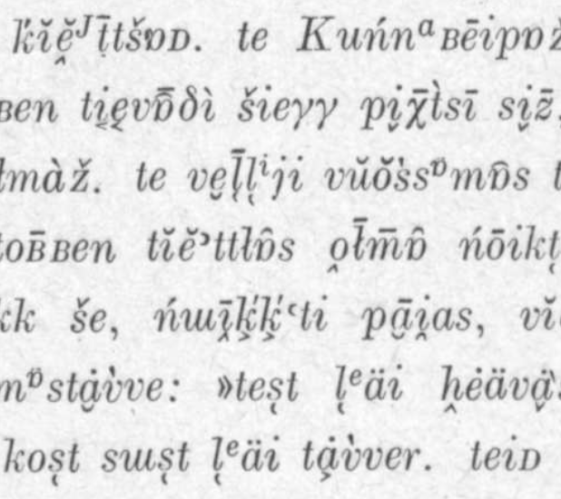

## Langdoc logo

The fish-logo used currently widely on langdoc-website and on affiliated locations (among these this GitHub repository) has to be replaced. Logos are always tricky, but ideally each project would have its own logo and distinct visual style. Unfortunately there tends to be so much work that visual questions such as these can be easy to dismiss and leave to a later date, which again never comes.

One idea could be to use a rotating logos which would be visually similar, but change every few months or so.

## Examples

The page numbers in filenames refer to the actual pages in PDF files stored in Fenno-Ugrica. This is potentially a bad idea, but it was first I came up with.

View to Kildin Saami text published in Koltan- ja kuolanlappalaisia satuja (Itkonen et. al. 1931, p. 15).

View to Komi-Zyrian text published in Syrjänische Volksdichtung (Wichmann 1916, p. 5).

